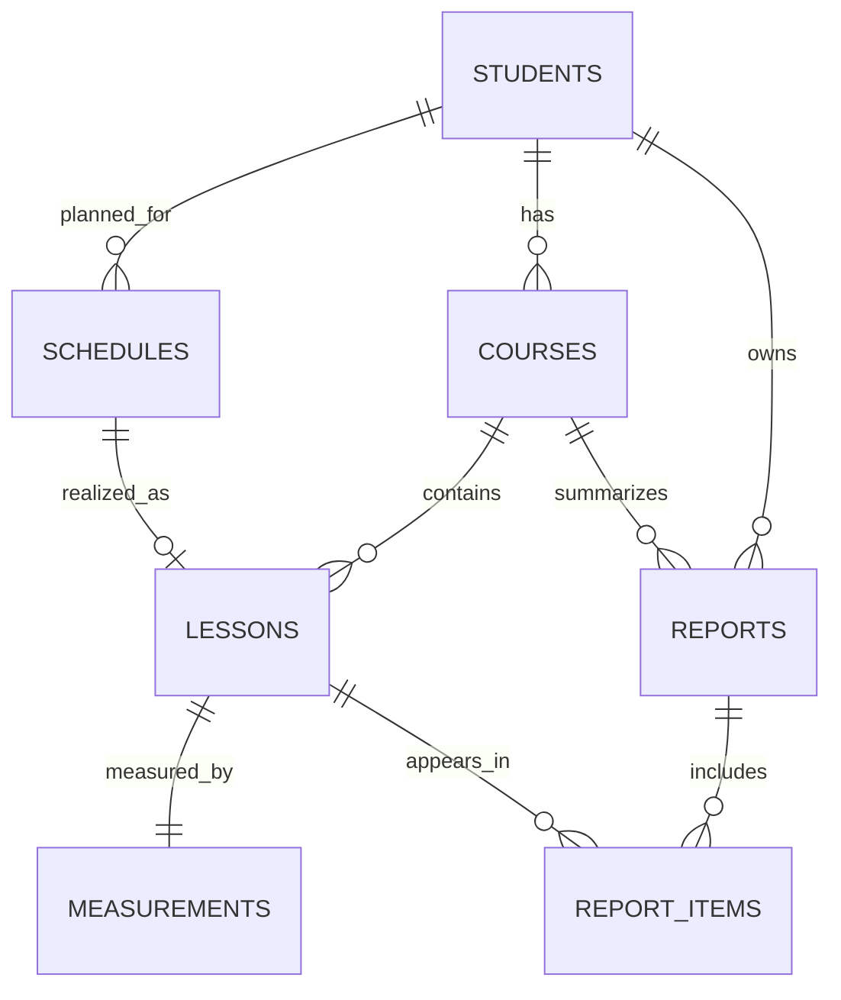
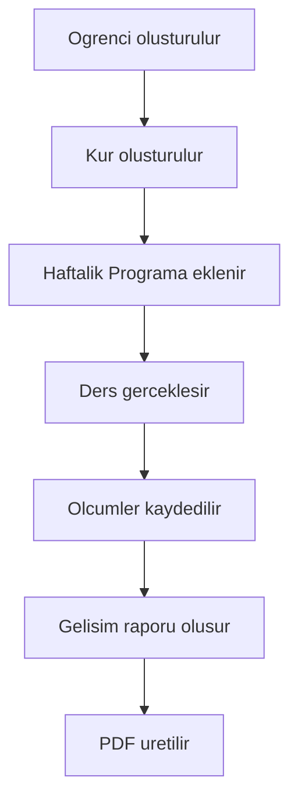

# Database README

## 1. Veritabaninin Amaci

Bu veritabani, IDIL HIZLI OKUMA Yonetim Sistemi'nin cekirdek is modelini kalici ve tutarli sekilde saklamak icin tasarlanmistir. Model; ogrenci yonetimi, kur yonetimi, haftalik planlama, gerceklesen ders kayitlari, performans olcumleri ve rapor uretimini destekler.

---

## 2. Kullanilan Veritabani

- Mevcut motor: SQLite
- Gelecek hedef: PostgreSQL uyumlulugu

Teknik yaklasim:

- SQLite icin CHECK tabanli durum kontrolu kullanilir.
- Tasarim ANSI SQL'e yakin tutuldugu icin PostgreSQL'e gecis kolaylastirilir.

---

## 3. Tablolar

- students: Ogrenci kimlik, iletisim ve operasyonel durum bilgileri.
- courses: Ogrencinin katildigi kur kayitlari (bir ogrenci birden fazla kur alabilir).
- schedules: Haftalik programdaki planlanan ders satirlari.
- lessons: Gerceklesen ders kayitlari (plan kaydindan ayridir).
- measurements: Ders performans olcumleri (kelime, sure, hiz, anlama, odak).
- reports: Uretilen rapor/PDF gecmisi.
- settings: Uygulama seviyesinde ayar anahtar/deger kayitlari.
- report_items: reports ile lessons arasindaki N-N iliskiyi kuran kopru tablo.

---

## 4. Tablolar Arasindaki Iliskiler

Temel iliski tipleri:

- 1-N: students -> courses
- 1-N: students -> schedules
- 1-N: courses -> lessons
- 1-1: lessons -> measurements
- N-N: reports <-> lessons (report_items uzerinden)

---

## 5. Veri Akisi

Temel operasyon akisi:

Kisa teknik aciklama:

1. Ogrenci `students` tablosunda olusturulur.
2. Ogrenciye bagli kur `courses` tablosunda acilir.
3. Planlama `schedules` tablosunda tutulur.
4. Gerceklesen ders `lessons` tablosuna yazilir.
5. Performans verileri `measurements` tablosuna kaydedilir.
6. Rapor kaydi `reports` ve gerekirse `report_items` ile olusturulur.

---

## 6. Veri Guncelleme Kurallari

Soft delete kullanimi:

- Kayitlar fiziksel olarak silinmez, `is_active = 0` yapilarak pasiflenir.
- Soft delete zamani `deleted_at` alanina yazilir.

Audit alanlari:

- `created_at`: ilk olusturma zamani
- `updated_at`: son guncelleme zamani
- `deleted_at`: pasifleme/silme zamani (NULL ise aktif)
- `is_active`: aktiflik bayragi (1 aktif, 0 pasif)

Operasyon notu:

- Listeleme ve raporlama sorgularinda varsayilan filtre `is_active = 1` olmalidir.

---

## 7. Isimlendirme Standartlari

- Alan adlari: snake_case
- Primary key: `id`
- Foreign key: `<parent_table>_id` (ornek: `student_id`, `course_id`)
- Index isimleri: `idx_<table>_<field_or_purpose>`

Ornekler:

- `idx_students_ad_soyad`
- `idx_lessons_course_lesson_no`
- `idx_reports_student_created_at`

---

## 8. Gelecek Genisletmeler

Ileride eklenebilecek tablolar:

- users
- roles
- attendance
- payments
- files
- notifications

Genisleme prensibi:

- Mevcut PK/FK butunlugu bozulmadan modul ekleme yapilir.

### Gelecek Yapi

Ilk resmi surumde (`v1.0`) veritabani yapisi sade tutulur ve sadece asagidaki dosyalar kullanilir:

- `schema.sql`
- `README.md`

Asagidaki klasorler bu surumde bilincli olarak olusturulmaz; ihtiyac olustukca `v1.0` sonrasinda eklenecektir:

- `migrations/`
- `backups/`
- `seeds/`

---

## 9. Surum Bilgisi

Veritabani Surumu: v1.0

Bu surum, IDIL HIZLI OKUMA Yonetim Sistemi'nin ilk resmi veritabani semasidir.
