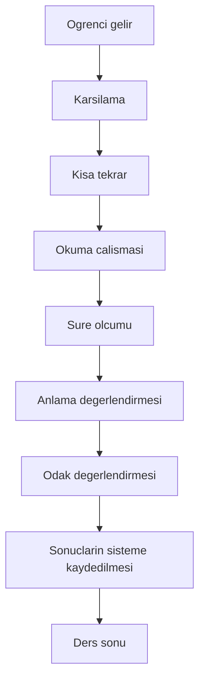

# Egitim Modeli Gereksinim Dokumani

## Belge Amaci

Bu belge yalnizca egitim surecini anlatan bir metin degildir. Bu dokuman;

- veritabani tasariminin,
- haftalik program ekraninin,
- ders kayit ekraninin,
- gelisim raporlarinin

olusturulacagi temel analiz dokumanidir.

---

## 1. Egitim Modeli

Bu egitim sistemi tamamen birebir ozel ders modeli uzerine kuruludur.

Temel kurallar:

- Egitimler birebir yapilir.
- Ayni anda yalnizca bir ogrenciyle ders yapilabilir.
- Ilk surumde sistemde yalnizca bir ogretmen bulunmaktadir.
- Haftalik program bu kisitlara gore planlanir.

---

## 2. Kur Yapisi

Kur sistemi asagidaki yapisal kurallara dayanir:

| Ozellik | Deger |
|---|---|
| Egitim Turu | Birebir |
| 1 Kur | 16 Ders |
| Sure | 4 Hafta |
| Haftalik Ders Gunu | 2 Gun |
| Gunluk Ders | 2 Ders |
| Ders Suresi | 35 Dakika |
| Ders Arasi Mola | 10 Dakika |

Bu kurallar sistemin temelini olusturur ve planlama, oturum yonetimi, raporlama ile kur tamamlama mekanizmalarinda degistirilemez cekirdek kisitlar olarak ele alinir.

---

## 3. Ders Oturumu (Session)

Bir oturum asagidaki adimlardan olusur:

- Iki dersten olusur.
- Ilk ders 35 dakika surer.
- Ardindan 10 dakika mola verilir.
- Ikinci ders 35 dakika surer.

Haftalik program ekraninda bir oturum tek kart olarak gosterilir.

---

## 4. Haftalik Program Kurallari

- Ayni saat araliginda yalnizca bir ogrenci planlanabilir.
- Ders cakismasina izin verilmez.
- Program haftalik gorunumde hazirlanir.
- Her kart bir ders oturumunu temsil eder.
- Her oturum icerisinde iki ders bulunur.

Ek kurallar:

- Cakismanin engellenmesi sistem tarafinda zorunlu dogrulama olarak uygulanir.
- Program degisiklikleri (iptal, telafi, yeniden planlama) kayit altina alinir.

---

## 5. Ders Akisi

Ders baslangicindan ders sonuna kadar is akisinin standart adimlari asagidadir:

---

## 6. Ders Sonunda Kaydedilen Bilgiler

Ders sonu veri girisi ve otomatik hesaplama alanlari:

| Alan | Aciklama | Giris Tipi |
|---|---|---|
| Tarih | Ders tarihi | Manuel |
| Ders No | Kur icindeki ders numarasi | Manuel/Sistem |
| Metin | Okunan metin | Manuel |
| Kelime Sayisi | Okunan toplam kelime | Manuel |
| Sure | Okuma suresi (dakika/saniye) | Manuel |
| Okuma Hizi | Sistem tarafindan otomatik hesaplanir | Otomatik |
| Anlama | Yuzde olarak girilir | Manuel |
| Odak | 1-10 arasi puanlanir | Manuel |
| Ogretmen Notu | Istege bagli aciklama alani | Manuel |

Okuma hizi sistem tarafindan otomatik hesaplanmalidir.

Ornek hesaplama mantigi:

- Okuma Hizi (kelime/dakika) = Toplam Kelime / Sure (dakika)

---

## 7. Ders Durumu

Desteklenen ders durumlari:

- Planlandi
- Yapildi
- Iptal Edildi
- Telafi Bekliyor
- Telafi Yapildi
- Tamamlandi

Bu durumlar raporlama, filtreleme ve performans analizlerinde kullanilacaktir.

---

## 8. Kur Tamamlama

Kurdaki 16. ders sonunda sistem otomatik olarak:

- Kuru tamamlar.
- Gelisim raporu olusturulabilir duruma getirir.
- PDF raporu hazirlanabilir duruma getirir.
- Yeni kur acilmasina izin verir.

---

## 9. Ogrenci Durumlari

| Ogrenci Durumu | Aciklama |
|---|---|
| Aktif | Egitime duzenli devam eden ogrenci |
| Ara Verdi | Gecici sureyle egitime ara veren ogrenci |
| Kur Tamamlandi | Mevcut kurunu tamamlamis ogrenci |
| Beklemede | Kayitli ancak aktif programa alinmamis ogrenci |
| Ayrildi | Egitim surecinden tamamen ayrilmis ogrenci |

---

## 10. Egitim Kurallari

- Ayni anda yalnizca bir ogrenciyle ders yapilabilir.
- Ayni saatte yalnizca bir ders planlanabilir.
- Bir ders 35 dakikadir.
- Dersler arasinda 10 dakika mola bulunur.
- Bir oturum iki dersten olusur.
- Bir kur 16 dersten olusur.
- Ogrenci ayni anda yalnizca bir aktif kurda bulunabilir.
- Her ders sonunda performans bilgileri sisteme kaydedilir.
- Kur tamamlandiginda gelisim raporu hazirlanabilir.
- Kur tamamlandiginda yeni kur acilabilir.

---

## Sonuc

Bu gereksinim dokumani, egitim modelinin is kurallarini yazilim gelistirme surecine dogrudan aktarilabilir sekilde tanimlar. Buradaki kurallar; veri modeli, ekran akislari, dogrulama mekanizmalari ve raporlama altyapisinin temelini olusturur.
