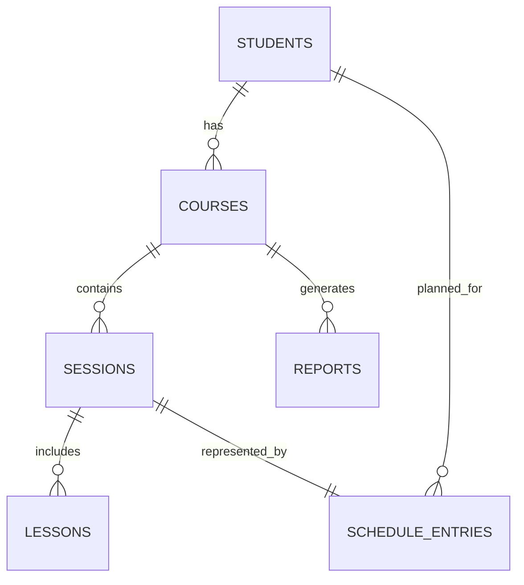

# Veritabani Tasarimi

## 1. Dokuman Amaci

Bu dokuman, egitim modeli gereksinimlerine dayali olarak sistemin veritabani yapisini tanimlar. Amaç;

- veri tutarliligini saglamak,
- haftalik programlama kurallarini desteklemek,
- ders performans olcumlerini kaydetmek,
- raporlama ve PDF uretim altyapisini beslemektir.

---

## 2. Veritabani Teknolojisi

Ilk surumde veritabani motoru olarak SQLite kullanilir.

| Bilesen | Tercih |
|---|---|
| Veritabani | SQLite |
| Yaklasim | Iliskisel model |
| Kimliklendirme | Integer Primary Key |
| Tarih/Saat | ISO-8601 metin formati |

---

## 3. Varliklar ve Iliskiler

Temel varliklar:

- Ogrenci
- Kur
- Oturum
- Ders
- Program Kaydi
- Rapor

Iliski ozeti:

- Bir ogrencinin birden fazla kuru olabilir.
- Bir kur 16 dersten olusur.
- Bir oturum iki dersi kapsar.
- Program kaydi bir oturumu takvim uzerinde temsil eder.
- Raporlar kur bazli uretilir.



---

## 4. Tablolar

### 4.1 students

| Alan | Tip | Zorunlu | Aciklama |
|---|---|---|---|
| id | INTEGER PK | Evet | Ogrenci kimligi |
| full_name | TEXT | Evet | Ad soyad |
| phone | TEXT | Hayir | Iletisim numarasi |
| email | TEXT | Hayir | E-posta |
| status | TEXT | Evet | Aktif, Ara Verdi, Kur Tamamlandi, Beklemede, Ayrildi |
| created_at | TEXT | Evet | Kayit tarihi |
| updated_at | TEXT | Evet | Son guncelleme |

Kisitlar:

- `status` yalnizca tanimli ogrenci durum degerlerinden biri olabilir.

### 4.2 courses

| Alan | Tip | Zorunlu | Aciklama |
|---|---|---|---|
| id | INTEGER PK | Evet | Kur kimligi |
| student_id | INTEGER FK | Evet | `students.id` baglantisi |
| course_no | INTEGER | Evet | Ogrenci icindeki kur sirasi |
| total_lessons | INTEGER | Evet | Varsayilan 16 |
| start_date | TEXT | Evet | Kur baslangici |
| end_date | TEXT | Hayir | Kur bitisi |
| status | TEXT | Evet | Active, Completed, Cancelled |
| created_at | TEXT | Evet | Kayit tarihi |

Kisitlar:

- `total_lessons = 16` olmalidir.
- Bir ogrencinin ayni anda yalnizca bir adet `Active` kuru olabilir.

### 4.3 sessions

| Alan | Tip | Zorunlu | Aciklama |
|---|---|---|---|
| id | INTEGER PK | Evet | Oturum kimligi |
| course_id | INTEGER FK | Evet | `courses.id` baglantisi |
| session_no | INTEGER | Evet | Kur icindeki oturum sirasi |
| lesson_count | INTEGER | Evet | Varsayilan 2 |
| planned_date | TEXT | Evet | Planlanan tarih |
| planned_start_time | TEXT | Evet | Baslangic saati |
| planned_end_time | TEXT | Evet | Bitis saati |
| status | TEXT | Evet | Planlandi, Yapildi, Iptal Edildi, Telafi Bekliyor, Telafi Yapildi, Tamamlandi |

Kisitlar:

- `lesson_count = 2` olmalidir.
- Oturum saatleri cakismaya neden olmayacak sekilde dogrulanmalidir.

### 4.4 lessons

| Alan | Tip | Zorunlu | Aciklama |
|---|---|---|---|
| id | INTEGER PK | Evet | Ders kimligi |
| session_id | INTEGER FK | Evet | `sessions.id` baglantisi |
| course_id | INTEGER FK | Evet | `courses.id` baglantisi |
| lesson_no | INTEGER | Evet | Kur icindeki ders numarasi (1-16) |
| lesson_date | TEXT | Evet | Ders tarihi |
| reading_text | TEXT | Hayir | Okunan metin |
| word_count | INTEGER | Hayir | Toplam kelime |
| duration_minutes | REAL | Hayir | Okuma suresi |
| reading_speed | REAL | Hayir | Kelime/dakika (otomatik) |
| comprehension_pct | REAL | Hayir | Anlama yuzdesi |
| focus_score | INTEGER | Hayir | 1-10 |
| teacher_note | TEXT | Hayir | Not alani |
| status | TEXT | Evet | Planlandi, Yapildi, Iptal Edildi, Telafi Bekliyor, Telafi Yapildi, Tamamlandi |
| created_at | TEXT | Evet | Kayit tarihi |

Kisitlar:

- `lesson_no` 1 ile 16 arasinda olmalidir.
- `focus_score` 1 ile 10 arasinda olmalidir.
- `comprehension_pct` 0 ile 100 arasinda olmalidir.
- `reading_speed` uygulama tarafinda otomatik hesaplanmalidir:
  - `reading_speed = word_count / duration_minutes`

### 4.5 schedule_entries

| Alan | Tip | Zorunlu | Aciklama |
|---|---|---|---|
| id | INTEGER PK | Evet | Program kaydi kimligi |
| student_id | INTEGER FK | Evet | `students.id` baglantisi |
| session_id | INTEGER FK | Evet | `sessions.id` baglantisi |
| week_start_date | TEXT | Evet | Hafta baslangici |
| day_of_week | INTEGER | Evet | 1-7 |
| start_time | TEXT | Evet | Baslangic saati |
| end_time | TEXT | Evet | Bitis saati |
| is_makeup | INTEGER | Evet | 0 normal, 1 telafi |

Kisitlar:

- Ayni gun ve ayni saat araliginda ikinci bir plan kaydi olusturulamaz.

### 4.6 reports

| Alan | Tip | Zorunlu | Aciklama |
|---|---|---|---|
| id | INTEGER PK | Evet | Rapor kimligi |
| student_id | INTEGER FK | Evet | `students.id` baglantisi |
| course_id | INTEGER FK | Evet | `courses.id` baglantisi |
| report_type | TEXT | Evet | Gelisim, Ozet, Kur Sonu |
| generated_at | TEXT | Evet | Rapor olusma zamani |
| file_path | TEXT | Hayir | PDF dosya yolu |
| summary_json | TEXT | Hayir | Hesaplanan ozet veriler |

---

## 5. Is Kurallari ve Veritabani Yansimalari

| Is Kurali | Veritabani Yansimasi |
|---|---|
| Ayni anda tek ogrenciyle ders | Program tablosunda zaman cakisma engeli |
| Bir oturum iki ders | `sessions.lesson_count = 2` |
| Bir kur 16 ders | `courses.total_lessons = 16`, `lessons.lesson_no` araligi |
| Tek aktif kur | Ogrenci bazli benzersiz aktif kur kontrolu |
| Ders sonu performans kaydi | `lessons` tablosundaki olcum alanlari |
| Kur bitince rapor | `reports` tablosu ve kur durumu |

---

## 6. Indeksleme Stratejisi

Performans icin asagidaki indeksler onerilir:

- `idx_courses_student_status (student_id, status)`
- `idx_sessions_course_date (course_id, planned_date)`
- `idx_lessons_course_no (course_id, lesson_no)`
- `idx_schedule_day_time (day_of_week, start_time, end_time)`
- `idx_reports_course_type (course_id, report_type)`

---

## 7. Ornek SQL DDL (SQLite)

```sql
CREATE TABLE IF NOT EXISTS students (
	id INTEGER PRIMARY KEY AUTOINCREMENT,
	full_name TEXT NOT NULL,
	phone TEXT,
	email TEXT,
	status TEXT NOT NULL CHECK (status IN ('Aktif', 'Ara Verdi', 'Kur Tamamlandi', 'Beklemede', 'Ayrildi')),
	created_at TEXT NOT NULL,
	updated_at TEXT NOT NULL
);

CREATE TABLE IF NOT EXISTS courses (
	id INTEGER PRIMARY KEY AUTOINCREMENT,
	student_id INTEGER NOT NULL,
	course_no INTEGER NOT NULL,
	total_lessons INTEGER NOT NULL DEFAULT 16 CHECK (total_lessons = 16),
	start_date TEXT NOT NULL,
	end_date TEXT,
	status TEXT NOT NULL CHECK (status IN ('Active', 'Completed', 'Cancelled')),
	created_at TEXT NOT NULL,
	FOREIGN KEY (student_id) REFERENCES students(id)
);

CREATE TABLE IF NOT EXISTS sessions (
	id INTEGER PRIMARY KEY AUTOINCREMENT,
	course_id INTEGER NOT NULL,
	session_no INTEGER NOT NULL,
	lesson_count INTEGER NOT NULL DEFAULT 2 CHECK (lesson_count = 2),
	planned_date TEXT NOT NULL,
	planned_start_time TEXT NOT NULL,
	planned_end_time TEXT NOT NULL,
	status TEXT NOT NULL CHECK (status IN ('Planlandi', 'Yapildi', 'Iptal Edildi', 'Telafi Bekliyor', 'Telafi Yapildi', 'Tamamlandi')),
	FOREIGN KEY (course_id) REFERENCES courses(id)
);

CREATE TABLE IF NOT EXISTS lessons (
	id INTEGER PRIMARY KEY AUTOINCREMENT,
	session_id INTEGER NOT NULL,
	course_id INTEGER NOT NULL,
	lesson_no INTEGER NOT NULL CHECK (lesson_no BETWEEN 1 AND 16),
	lesson_date TEXT NOT NULL,
	reading_text TEXT,
	word_count INTEGER,
	duration_minutes REAL,
	reading_speed REAL,
	comprehension_pct REAL CHECK (comprehension_pct BETWEEN 0 AND 100),
	focus_score INTEGER CHECK (focus_score BETWEEN 1 AND 10),
	teacher_note TEXT,
	status TEXT NOT NULL CHECK (status IN ('Planlandi', 'Yapildi', 'Iptal Edildi', 'Telafi Bekliyor', 'Telafi Yapildi', 'Tamamlandi')),
	created_at TEXT NOT NULL,
	FOREIGN KEY (session_id) REFERENCES sessions(id),
	FOREIGN KEY (course_id) REFERENCES courses(id)
);
```

---

## 8. Veri Tutarliligi Notlari

- Oturum zaman cakismasi uygulama servis katmaninda kontrol edilmelidir.
- `reading_speed` degeri manuel girilmemeli, hesaplama ile yazilmalidir.
- Kur tamamlanma kosulu: `lesson_no = 16` ve ilgili dersin durumu `Tamamlandi`.
- Kur tamamlaninca rapor olusturma islemi tetiklenebilir.

---

## 9. Sonraki Dokumanlara Girdi

Bu tasarim asagidaki dokumanlarin teknik temelini saglar:

- Haftalik Program Ekrani
- Ders Kayit Ekrani
- Gelisim Raporlama Modulu
- PDF Rapor Uretimi
