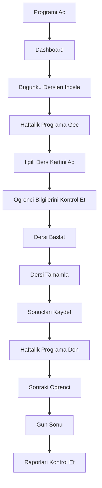
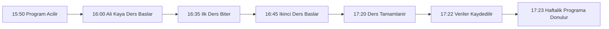

# IDIL HIZLI OKUMA - User Journey Dokumani

## 1. Belgenin Amaci

Bu dokuman, ogretmenin gunluk kullanim yolculugunu standartlastirmak ve urun gelistirme surecinde ortak referans belge olarak kullanilmak uzere hazirlanmistir.

Hedefler:

- Kullanici deneyimini olculebilir ve tekrar edilebilir hale getirmek
- Ekranlar arasi gecislerde tutarlilik saglamak
- Tasarim ve gelistirme ekipleri icin ortak karar zemini olusturmak
- Ana is akislarinda hiz, netlik ve ergonomiyi korumak

---

## 2. Kullanici Profili

Tanımlanan birincil kullanici profili:

- Hizli okuma egitmeni
- Ayni anda yalnizca bir ogrenciyle calisan ogretmen
- Gunluk ders programina gore calisan kullanici

| Profil Ozeti | Deger |
|---|---|
| Rol | Ogretmen / Egitmen |
| Calisma Bicimi | Birebir ders modeli |
| Gunluk Odak | Planli dersleri zamaninda ve verimli tamamlama |
| Kritik Ihtiyac | Hizli erisim, hizli veri girisi, hata riskinin azaltilmasi |

---

## 3. Gunluk Kullanim Senaryosu

Ogretmenin tipik is gunu akisi:

Akis aciklamasi:

1. Program acildiginda ogretmen once genel durumu Dashboard uzerinden gorur.
2. Bugunku ders listesi hizli kontrol edilir.
3. Haftalik Program ekraninda ilgili saat ve ogrenci secilir.
4. Ders kartindan ogrenci ve kur bilgileri dogrulanir.
5. Ders tamamlandiktan sonra performans verileri kaydedilir.
6. Ogretmen bir sonraki ogrenciye gecer ve gun sonunda raporlari kontrol eder.

---

## 4. Ana Kullanici Akislari

### 4.1 Yeni Ogrenci Ekleme

1. Sidebar uzerinden Ogrenciler ekranina gecilir.
2. Yeni Ogrenci butonu secilir.
3. Zorunlu alanlar doldurulur.
4. Ogrenci durumu Aktif veya Beklemede olarak belirlenir.
5. Kaydet ile listeye eklenir ve ogrenci karti olusturulur.

### 4.2 Haftalik Programa Ders Yerlestirme

1. Haftalik Program ekraninda bos saat secilir.
2. Time Picker ile saat atanir veya duzenlenir.
3. Ogrenci secimi yapilir.
4. Kur ve ders no bilgisi belirlenir.
5. Kaydet ile slot ders kartina donusur.

### 4.3 Ders Duzenleme

1. Dolu ders karti secilir.
2. Sag panel acilir.
3. Saat, durum veya not alanlari duzenlenir.
4. Kaydet ile kart ve ozet metrikler guncellenir.

### 4.4 Ders Iptali

1. Ders karti secilir.
2. Hizli islemlerden Iptal/Sil aksiyonu secilir.
3. Onay diyalogu gosterilir.
4. Ders durumu Iptal Edildi olarak isaretlenir.
5. Slot yeniden planlama icin uygun hale getirilir.

### 4.5 Telafi Dersi Olusturma

1. Iptal veya Telafi Bekliyor durumundaki ders secilir.
2. Telafi olustur aksiyonu secilir.
3. Uygun saat belirlenir.
4. Yeni ders kaydi telafi etiketi ile olusturulur.
5. Takvim ve raporlama durumu guncellenir.

### 4.6 Ders Tamamlama

1. Ders Ekrani acilir.
2. Okuma metni, sure, kelime sayisi girilir.
3. Anlama ve odak puani eklenir.
4. Sistem okuma hizini otomatik hesaplar.
5. Durum Tamamlandi olarak kaydedilir.

### 4.7 Gelisim Raporu Goruntuleme

1. Gelişim Raporu ekranina gecilir.
2. Ogrenci ve kur secilir.
3. Grafikler ve trendler incelenir.
4. Gerekiyorsa not veya yorum eklenir.

### 4.8 PDF Olusturma

1. Rapor ekrani veya PDF modulunden olustur secilir.
2. Icerik kapsamı belirlenir.
3. Onizleme kontrol edilir.
4. PDF cikti olusturulur ve kaydedilir.

### 4.9 Akis Ozet Tablosu

| Akis | Baslangic Ekrani | Bitis Ekrani | Basari Kriteri |
|---|---|---|---|
| Yeni Ogrenci | Ogrenciler | Ogrenci Karti | Ogrenci kaydi olusmasi |
| Ders Planlama | Haftalik Program | Haftalik Program | Slotun dolu karta donusmesi |
| Ders Tamamlama | Ders Ekrani | Haftalik Program | Verilerin kaydedilmesi |
| Raporlama | Gelisim Raporu | PDF Onizleme | Raporun olusturulmasi |

---

## 5. Kullanici Hedefleri

Ekran bazli hedefler:

| Ekran | Ogretmenin Amaci |
|---|---|
| Dashboard | Gunu ve oncelikleri hizla gormek |
| Haftalik Program | Plani yonetmek, bos/dolu saatleri takip etmek |
| Ogrenci Yonetimi | Ogrenci kayitlarini duzenlemek |
| Ogrenci Karti | Ogrenci gecmisi ve kur durumunu incelemek |
| Ders Ekrani | Hizli ve hatasiz veri girisi yapmak |
| Gelisim Raporu | Ogrenci ilerlemesini analiz etmek |
| PDF Onizleme | Veli/kurum paylasimi icin cikti hazirlamak |

---

## 6. Kullanici Deneyimi Ilkeleri

- En fazla 3 tiklamada istenen bilgiye ulasilmalidir.
- Veri girisi mumkun oldugunca hizli olmalidir.
- Ayni islem icin gereksiz tekrar olmamalidir.
- Kritik bilgiler tek bakista gorulebilmelidir.
- Ogretmenin dikkatini dagitacak ogeler kullanilmamalidir.

Uygulama prensipleri:

- Birincil eylemler her ekranda belirgin ve tekil olmalidir.
- Form alanlari acik etiket ve anlik hata geri bildirimi vermelidir.
- Durum renkleri tum modullerde ayni anlami tasimalidir.

---

## 7. Ornek Gunluk Senaryo

Saat bazli senaryo:

- 15:50 -> Program acilir.
- 16:00 -> Ali Kaya dersi baslar.
- 16:35 -> Ilk ders biter.
- 16:45 -> Ikinci ders baslar.
- 17:20 -> Ders tamamlanir.
- 17:22 -> Veriler kaydedilir.
- 17:23 -> Haftalik Programa donulur.

Ayrintili aciklama:

1. 15:50'de ogretmen uygulamayi acarak Dashboard'da bugunku akisi kontrol eder.
2. 16:00'da Haftalik Program ekranindaki ilgili ders kartindan Dersi Baslat eylemiyle oturumu acilir.
3. 16:35'te ilk 35 dakikalik ders tamamlanir ve sistem mola asamasina gecer.
4. 16:45'te ikinci ders baslatilir ve planlanan ikinci bolum uygulanir.
5. 17:20'de oturum sonlandirilir, ders durumu tamamlandi olarak isaretlenir.
6. 17:22'de okuma metni, sure, kelime sayisi, anlama ve odak degerleri girilir; okuma hizi otomatik hesaplanir.
7. 17:23'te kayit tamamlanir ve ogretmen Haftalik Program ekranina geri donerek sonraki ogrenciye hazirlanir.

Senaryo akis diyagrami:

---

## 8. Sonuc

Bu dokuman, tum ekranlarin tasarimina ve kullanici deneyimine yon verecek temel UX referansidir.

Beklenen etkiler:

- Ekranlar arasi tutarli deneyim
- Ogretmenin gunluk is yukunde hiz kazanci
- Veri giris hatalarinda azalma
- Raporlama kalitesinde artis

Bu yapi, urunun hem tasarim kararlarini hem de gelistirme onceliklerini kullanici merkezli bir cercevede birlestirir.

---

## 9. İstisna Senaryoları (Exception Scenarios)

Bu bolum, ogretmenin gunluk kullanim sirasinda karsilasabilecegi olagan disi durumlari tanimlar.

### 9.1 Ogrenci Derse Gelmedi

- Senaryo: Planlanan ders saatinde ogrenci derse katilim saglamaz.
- Olasi Neden: Ogrenci devamsizligi, haber verilmeyen iptal, ulasim sorunu.
- Sistem Davranisi: Ders durumu `Gelmedi` olarak isaretlenebilir; ders otomatik olarak telafi bekleyenler listesine alinir; Haftalik Program ekraninda uygun durum rengiyle gosterilir.
- Ogretmen Aksiyonu: Durumu `Gelmedi` olarak kaydeder, gerekirse veliye bilgilendirme notu ekler ve telafi icin uygun zaman araligini belirler.
- Sonuc: Ders kaydi veri butunlugunu koruyacak sekilde kapanir, telafi sureci takip edilebilir hale gelir.

### 9.2 Ogrenci Gec Geldi

- Senaryo: Ogrenci ders saatinden sonra derse katilir.
- Olasi Neden: Trafik, okul cikis gecikmesi, iletisim gecikmesi.
- Sistem Davranisi: Ders gec baslatilabilir; gercek baslangic saati kaydedilir; sure ve rapor hesaplari gerceklesen zamana gore guncellenir.
- Ogretmen Aksiyonu: Dersi fiili baslangic saatiyle baslatir, not alanina gecikme bilgisini ekler.
- Sonuc: Performans metrikleri gercege uygun hesaplanir, raporlarda yanlis yorum riski azalir.

### 9.3 Ders Yarida Kaldi

- Senaryo: Ders planlanan sure tamamlanmadan sonlandirilmak zorunda kalir.
- Olasi Neden: Ogrenci saglik durumu, acil durum, dikkat kaybi, teknik problem.
- Sistem Davranisi: Ders `Yarim Kaldi` durumuna alinabilir; kayit tamamlanmadan taslak olarak saklanir; ders daha sonra devam veya telafi planina aktarilabilir.
- Ogretmen Aksiyonu: Dersi `Yarim Kaldi` olarak isaretler, kalan icerigi belirterek devam/telafi karari verir.
- Sonuc: Ders butunlugu korunur, eksik kalan bolum kontrollu sekilde yeniden planlanir.

### 9.4 Elektrik / Internet Kesintisi

- Senaryo: Ders sirasinda uygulama baglantisi veya enerji kesintisi yasanir.
- Olasi Neden: Elektrik kesintisi, internet kopmasi, cihaz kapanmasi.
- Sistem Davranisi: Acik ders verileri guvenli sekilde kaydedilir; uygulama yeniden acildiginda son oturumdan devam mekanizmasi sunulur.
- Ogretmen Aksiyonu: Uygulama tekrar acildiginda dersi kontrol eder, gerekirse eksik alanlari tamamlar ve dersi devam ettirir.
- Sonuc: Veri kaybi minimize edilir, ders akisinda kesinti olsa da kayit surekliligi korunur.

### 9.5 Yanlis Ogrenci Secildi

- Senaryo: Ders karti acilirken hatali ogrenci secilir.
- Olasi Neden: Benzer isimler, hizli tiklama, dikkatsizlik.
- Sistem Davranisi: Ders baslamadan ogrenci degisikligine izin verilir; ders basladiktan sonra degisiklikte uyari gosterilir.
- Ogretmen Aksiyonu: Baslangic oncesi dogru ogrenciyi secerek kaydi gunceller; ders basladiysa uyariya gore duzeltme adimini uygular.
- Sonuc: Yanlis ogrenciye veri yazilmasi engellenir, rapor dogrulugu korunur.

### 9.6 Yanlis Veri Girildi

- Senaryo: Ders sonunda kaydedilen metriklerde hatali giris yapilir.
- Olasi Neden: Sayisal deger hatasi, yanlis alan secimi, acele veri girisi.
- Sistem Davranisi: Son ders kaydi duzenlenebilir; gelecekte degisiklikler kayit gecmisine islenebilir (audit trail).
- Ogretmen Aksiyonu: Hatali alani duzeltir, kaydi tekrar onaylar.
- Sonuc: Veri kalitesi korunur; gecmis izleme mekanizmasi devreye alindiginda degisiklikler izlenebilir olur.

### 9.7 Ayni Saate Ikinci Ogrenci Eklenmeye Calisildi

- Senaryo: Ogretmen ayni saat araligina ikinci bir ogrenci planlamaya calisir.
- Olasi Neden: Takvim yogunlugu, gozden kacirma, manuel saat duzenleme.
- Sistem Davranisi: Sistem zaman cakismasini aninda tespit eder, kullaniciya uyari gosterir ve kaydetme islemini engeller.
- Ogretmen Aksiyonu: Alternatif saat secerek plani yeniden duzenler.
- Sonuc: Cift rezervasyon engellenir, haftalik planin operasyonel tutarliligi korunur.

### 9.8 Kur Tamamlanmadan Yeni Kur Acilmak Istendi

- Senaryo: Mevcut kur tamamlanmadan ayni ogrenci icin yeni kur baslatilmak istenir.
- Olasi Neden: Yanlis islem, kur durumunun yanlis yorumlanmasi, acele planlama.
- Sistem Davranisi: Sistem uyari verir; mevcut kur tamamlanmadan yeni kur acilmasina izin vermez; gelecek surumde yetkili onayi gerektiren istisna olarak isaretlenebilir.
- Ogretmen Aksiyonu: Mevcut kur ilerlemesini kontrol eder, gerekiyorsa once mevcut kuru tamamlar veya yetkili surecini baslatir.
- Sonuc: Kur yapisi ve ogrenci egitim gecmisi bozulmadan korunur.

Bu istisna senaryolari, uygulamanin hata yonetimi, kullanici deneyimi ve veri butunlugunu korumak amaciyla hazirlanmistir. Gelistirme surecinde bu senaryolar referans alinacaktir.
