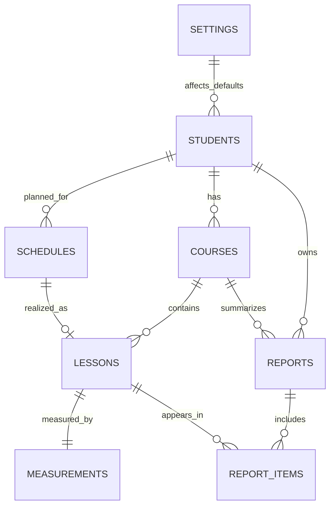

# IDIL HIZLI OKUMA - Database Design Specification (ERD)

## 1. Belgenin Amaci

Bu dokuman, IDIL HIZLI OKUMA Yonetim Sistemi icin ana veri modelini tanimlayan teknik referanstir.

Hedef:

- Uzun yillar surdurulebilir bir veritabani mimarisi kurmak
- Is modelini ekranlardan bagimsiz dogru temsil etmek
- SQLite ile hemen calisacak, PostgreSQL'e tasinabilir bir tasarim sunmak
- Dashboard, Haftalik Program, Ders Kayitlari ve Gelisim Raporlari ekranlarini ayni veri modelinden beslemek

Bu belge, ileride fiziksel veritabani olusturma adimlarinda dogrudan kaynak olarak kullanilacaktir.

---

## 2. Tasarim Ilkeleri

### 2.1 Normalizasyon

- En az 3NF hedeflenir.
- Tekrarlayan veri yerine iliski kullanilir.
- Planlanan veri (`schedules`) ve gerceklesen veri (`lessons`) ayridir.
- Performans metrikleri, ders kaydindan ayri `measurements` tablosunda tutulur.

### 2.2 Veri Butunlugu

- PK, FK, UNIQUE, CHECK kurallari zorunludur.
- Durum alanlari standart status sozlugune gore kontrol edilir.
- Kritik alanlarda NULL kisitlari ile veri tamligi korunur.

### 2.3 Performans

- Listeleme ve raporlama senaryolari icin hedefli indeksler tanimlanir.
- Yazma maliyeti ile okuma hizi dengelenir.
- Zaman bazli sorgular icin tarih/saat alanlari ayri tasarlanir.

### 2.4 Olceklenebilirlik

- Tek kullanicili baslangic modeli, cok kullanicili yapiya genisletilebilir.
- Soft delete ve audit alanlari ile operasyonel gecmis korunur.
- Iliski modeli, yeni moduller eklendiginde bozulmadan buyuyebilir.

### 2.5 SQLite Uyumlulugu

- SQLite'ta ENUM yerine CHECK + metin degerleri kullanilir.
- JSON benzeri alanlar metin veya ayri tabloda saklanir.
- Trigger kullanimi opsiyonel, uygulama katmani kurallari acik tanimlidir.

### 2.6 PostgreSQL'e Tasinabilirlik

- Tipler ANSI SQL'e yakin secilir.
- Status alanlari PostgreSQL'de ENUM/DOMAIN'e donusturulebilir.
- Tarih/saat alanlari `TIMESTAMP WITH TIME ZONE` modeline tasinmaya uygundur.

---

## 3. ER Diyagrami

Asagidaki diyagram ana tablolari ve iliski tiplerini (1-1, 1-N, N-N) gosterir.

Iliski notlari:

- 1-N: `students -> courses`, `students -> schedules`, `courses -> lessons`
- 1-1: `lessons -> measurements` (mevcut modelde bir ders icin bir olcum kaydi)
- N-N: `reports <-> lessons` iliskisi `report_items` kopru tablosu ile cozulur

Not: `report_items` teknik olarak kopru tablodur; ana tablo listesini bozmadan N-N iliskiyi dogru modellemek icin eklenmistir.

---

## 4. Tablo Tanimlari (Genel)

Tum tablolarda ortak tasarim yaklasimi:

- PK: `id` (INTEGER)
- Audit: `created_at`, `updated_at`
- Soft delete: `is_active` (1/0), `deleted_at` (opsiyonel)

Audit alanlarinin amaci:

- `created_at`: kaydin ilk olusturulma zamani
- `updated_at`: kaydin son degistirilme zamani

Soft delete amaci:

- Kaydi fiziksel olarak silmeden pasife almak
- Raporlama ve gecmis izleme surekliligi saglamak
- Yanlis silme durumunda geri kazanima imkan vermek

Status standardi (ENUM mantigi):

- Aktif
- Beklemede
- Planlandi
- Tamamlandi
- Gelmedi
- Iptal
- Telafi Bekliyor
- Yarim Kaldi

SQLite uygulamasi:

- `status TEXT CHECK(status IN (...))`

PostgreSQL tasinma modeli:

- `CREATE TYPE status_type AS ENUM (...)` veya domain yapisi

---

## 5. students Tablosu

Amac:

- Ogrencinin kimlik, iletisim ve temel operasyon bilgilerini tutar.

| Alan | Tip | PK | FK | Zorunlu | Aciklama |
|---|---|---|---|---|---|
| id | INTEGER | Evet | Hayir | Evet | Ogrenci benzersiz kimligi |
| ad_soyad | TEXT | Hayir | Hayir | Evet | Ogrenci tam adi |
| sinif | TEXT | Hayir | Hayir | Hayir | Sinif veya seviye bilgisi |
| veli_adi | TEXT | Hayir | Hayir | Hayir | Veli/ebeveyn adi |
| telefon | TEXT | Hayir | Hayir | Hayir | Iletisim telefonu |
| eposta | TEXT | Hayir | Hayir | Hayir | E-posta adresi |
| baslangic_tarihi | TEXT | Hayir | Hayir | Evet | Ogrenci baslangic tarihi |
| durum | TEXT | Hayir | Hayir | Evet | Aktif/Beklemede vb. |
| notlar | TEXT | Hayir | Hayir | Hayir | Serbest not |
| created_at | TEXT | Hayir | Hayir | Evet | Kayit olusturma zamani |
| updated_at | TEXT | Hayir | Hayir | Evet | Son guncelleme zamani |
| is_active | INTEGER | Hayir | Hayir | Evet | 1 aktif, 0 pasif |
| deleted_at | TEXT | Hayir | Hayir | Hayir | Soft delete zamani |

Kisitlar:

- `durum` CHECK ile status listesine baglanir.
- `eposta` format kontrolu uygulama katmaninda dogrulanir.

---

## 6. courses Tablosu

Amac:

- Ogrencinin katildigi kurlari tutar.
- Bir ogrenci birden fazla kur alabilir.
- Her kur hedef olarak 16 dersten olusur.

| Alan | Tip | PK | FK | Zorunlu | Aciklama |
|---|---|---|---|---|---|
| id | INTEGER | Evet | Hayir | Evet | Kur kimligi |
| student_id | INTEGER | Hayir | students.id | Evet | Kurun bagli oldugu ogrenci |
| kur_no | INTEGER | Hayir | Hayir | Evet | Ogrenci bazinda kur sirasi |
| baslangic | TEXT | Hayir | Hayir | Evet | Kur baslangic tarihi |
| bitis | TEXT | Hayir | Hayir | Hayir | Kur bitis tarihi |
| durum | TEXT | Hayir | Hayir | Evet | Aktif/Tamamlandi/Iptal vb. |
| hedef_ders_sayisi | INTEGER | Hayir | Hayir | Evet | Varsayilan 16 |
| created_at | TEXT | Hayir | Hayir | Evet | Kayit olusturma zamani |
| updated_at | TEXT | Hayir | Hayir | Evet | Son guncelleme zamani |
| is_active | INTEGER | Hayir | Hayir | Evet | 1 aktif, 0 pasif |
| deleted_at | TEXT | Hayir | Hayir | Hayir | Soft delete zamani |

Kisitlar:

- `student_id` zorunlu FK.
- `hedef_ders_sayisi` default 16.
- `UNIQUE(student_id, kur_no)` onerilir.

---

## 7. schedules Tablosu

Amac:

- Haftalik programdaki planlanan dersleri tutar.
- Planlama verisi ile gerceklesme verisi ayridir.

Kritik ayrim:

- `schedules` = plan (niyet)
- `lessons` = gerceklesen kayit (fiili)

| Alan | Tip | PK | FK | Zorunlu | Aciklama |
|---|---|---|---|---|---|
| id | INTEGER | Evet | Hayir | Evet | Program satiri kimligi |
| student_id | INTEGER | Hayir | students.id | Evet | Planlanan ogrenci |
| course_id | INTEGER | Hayir | courses.id | Hayir | Ilgili kur (opsiyonel) |
| plan_tarihi | TEXT | Hayir | Hayir | Evet | Planlanan tarih |
| baslangic_saati | TEXT | Hayir | Hayir | Evet | Planlanan baslangic |
| bitis_saati | TEXT | Hayir | Hayir | Evet | Planlanan bitis |
| durum | TEXT | Hayir | Hayir | Evet | Planlandi/Gelmedi/Iptal vb. |
| aciklama | TEXT | Hayir | Hayir | Hayir | Plan notu |
| created_at | TEXT | Hayir | Hayir | Evet | Kayit olusturma zamani |
| updated_at | TEXT | Hayir | Hayir | Evet | Son guncelleme zamani |
| is_active | INTEGER | Hayir | Hayir | Evet | 1 aktif, 0 pasif |
| deleted_at | TEXT | Hayir | Hayir | Hayir | Soft delete zamani |

Kisitlar:

- Cakisma engeli icin `(plan_tarihi, baslangic_saati, bitis_saati, is_active)` kombinasyonunda uygulama seviyesinde kontrol zorunlu.
- Tek ogretmen modelinde ayni zaman araligina ikinci plan girisi engellenir.

---

## 8. lessons Tablosu

Amac:

- Gerceklesen ders kayitlarini tutar.
- Planlanan kayitla bag kurabilir ama plan kaydindan bagimsiz da olusturulabilir.

| Alan | Tip | PK | FK | Zorunlu | Aciklama |
|---|---|---|---|---|---|
| id | INTEGER | Evet | Hayir | Evet | Ders kaydi kimligi |
| schedule_id | INTEGER | Hayir | schedules.id | Hayir | Ilgili plan kaydi |
| course_id | INTEGER | Hayir | courses.id | Evet | Dersin bagli oldugu kur |
| lesson_no | INTEGER | Hayir | Hayir | Evet | Kur icindeki ders numarasi (1-16) |
| tarih | TEXT | Hayir | Hayir | Evet | Gercek ders tarihi |
| metin | TEXT | Hayir | Hayir | Hayir | Okunan metin |
| durum | TEXT | Hayir | Hayir | Evet | Tamamlandi/Gelmedi/Yarim Kaldi vb. |
| ogretmen_notu | TEXT | Hayir | Hayir | Hayir | Ders notu |
| baslangic_gercek | TEXT | Hayir | Hayir | Hayir | Fiili baslangic zamani |
| bitis_gercek | TEXT | Hayir | Hayir | Hayir | Fiili bitis zamani |
| created_at | TEXT | Hayir | Hayir | Evet | Kayit olusturma zamani |
| updated_at | TEXT | Hayir | Hayir | Evet | Son guncelleme zamani |
| is_active | INTEGER | Hayir | Hayir | Evet | 1 aktif, 0 pasif |
| deleted_at | TEXT | Hayir | Hayir | Hayir | Soft delete zamani |

Kisitlar:

- `lesson_no` icin CHECK `1 <= lesson_no <= 16`.
- `UNIQUE(course_id, lesson_no, is_active)` onerilir.

---

## 9. measurements Tablosu

Amac:

- Performans olcumlerini ders kaydindan ayri tabloda tutar.
- Ders ile bagimli ama normalized model icin ayri varliktir.

| Alan | Tip | PK | FK | Zorunlu | Aciklama |
|---|---|---|---|---|---|
| id | INTEGER | Evet | Hayir | Evet | Olcum kaydi kimligi |
| lesson_id | INTEGER | Hayir | lessons.id | Evet | Bagli ders kaydi |
| kelime_sayisi | INTEGER | Hayir | Hayir | Evet | Okunan toplam kelime |
| sure | REAL | Hayir | Hayir | Evet | Sure (dakika veya saniye standardi ile) |
| okuma_hizi | REAL | Hayir | Hayir | Evet | Sistem tarafindan hesaplanan alan |
| anlama | REAL | Hayir | Hayir | Evet | Yuzde degeri (0-100) |
| odak | INTEGER | Hayir | Hayir | Evet | Puan (1-10) |
| created_at | TEXT | Hayir | Hayir | Evet | Kayit olusturma zamani |
| updated_at | TEXT | Hayir | Hayir | Evet | Son guncelleme zamani |
| is_active | INTEGER | Hayir | Hayir | Evet | 1 aktif, 0 pasif |
| deleted_at | TEXT | Hayir | Hayir | Hayir | Soft delete zamani |

Kisitlar:

- `lesson_id` UNIQUE ile 1-1 iliski korunur.
- `okuma_hizi` manuel giris degil, hesaplama alanidir.
- Onerilen hesap: `okuma_hizi = kelime_sayisi / sure`.

---

## 10. reports Tablosu

Amac:

- Uretilen rapor/PDF gecmisini tutar.
- Ogrenci ve kur bazli rapor ciktilari saklanir.

| Alan | Tip | PK | FK | Zorunlu | Aciklama |
|---|---|---|---|---|---|
| id | INTEGER | Evet | Hayir | Evet | Rapor kimligi |
| student_id | INTEGER | Hayir | students.id | Evet | Raporun ait oldugu ogrenci |
| course_id | INTEGER | Hayir | courses.id | Hayir | Ilgili kur |
| rapor_tipi | TEXT | Hayir | Hayir | Evet | Haftalik, Kur Sonu, Ozel |
| baslangic_tarih | TEXT | Hayir | Hayir | Hayir | Rapor kapsami baslangici |
| bitis_tarih | TEXT | Hayir | Hayir | Hayir | Rapor kapsami bitisi |
| dosya_yolu | TEXT | Hayir | Hayir | Hayir | Uretilen PDF yolu |
| created_at | TEXT | Hayir | Hayir | Evet | Kayit olusturma zamani |
| updated_at | TEXT | Hayir | Hayir | Evet | Son guncelleme zamani |
| is_active | INTEGER | Hayir | Hayir | Evet | 1 aktif, 0 pasif |
| deleted_at | TEXT | Hayir | Hayir | Hayir | Soft delete zamani |

N-N iliski icin kopru tablo (`report_items`) onerisi:

- `report_items(id, report_id, lesson_id, created_at)`
- Bir rapor birden fazla dersi icerebilir.
- Bir ders birden fazla raporda yer alabilir.

---

## 11. settings Tablosu

Amac:

- Uygulama genel ayarlarini tutar.
- Tek kullanici modelde global ayarlar burada saklanir.

| Alan | Tip | PK | FK | Zorunlu | Aciklama |
|---|---|---|---|---|---|
| id | INTEGER | Evet | Hayir | Evet | Ayar kimligi |
| ayar_anahtari | TEXT | Hayir | Hayir | Evet | Ayar anahtari |
| ayar_degeri | TEXT | Hayir | Hayir | Evet | Ayar degeri |
| kategori | TEXT | Hayir | Hayir | Hayir | UI, raporlama, sistem vb. |
| aciklama | TEXT | Hayir | Hayir | Hayir | Ayar aciklamasi |
| created_at | TEXT | Hayir | Hayir | Evet | Kayit olusturma zamani |
| updated_at | TEXT | Hayir | Hayir | Evet | Son guncelleme zamani |
| is_active | INTEGER | Hayir | Hayir | Evet | 1 aktif, 0 pasif |
| deleted_at | TEXT | Hayir | Hayir | Hayir | Soft delete zamani |

Kisitlar:

- `UNIQUE(ayar_anahtari, is_active)` onerilir.

---

## 12. Indeks Stratejisi

Asagidaki indeksler performans icin onerilir:

| Tablo | Alan(lar) | Neden |
|---|---|---|
| students | ad_soyad | Hizli ogrenci arama |
| students | durum | Durum bazli filtreleme |
| courses | student_id, kur_no | Ogrencinin kur gecmisi |
| courses | durum | Aktif/kapali kur filtreleri |
| schedules | plan_tarihi, baslangic_saati | Haftalik takvim sorgulari |
| schedules | durum | Plan durumuna gore listeleme |
| lessons | tarih | Ders kaydi tarih filtreleri |
| lessons | course_id, lesson_no | Kur icindeki ders sirasi |
| lessons | durum | Tamamlandi/Gelmedi filtreleri |
| measurements | lesson_id | Ders-olcum birlestirme |
| reports | student_id, created_at | Rapor gecmisi sorgulari |
| reports | rapor_tipi | Rapor tipine gore listeleme |

Not:

- Soft delete kullanildigi icin kritik sorgular `is_active = 1` kosulu ile calismalidir.

---

## 13. Gelecek Genisletmeler

Ileride eklenebilecek tablolar:

- users
- roles
- user_roles
- payments
- attendance
- notifications
- sms_logs
- whatsapp_logs

Genisleme prensipleri:

- Mevcut PK/FK yapisi bozulmadan yeni modul eklenmeli
- Yetkilendirme geldigin de `created_by`, `updated_by` alanlari tum tablolara eklenebilir
- Finans ve mesajlasma modulleri ayri bounded context olarak tutulmalidir

---

## 14. Teknik Analiz (Kisa)

### Guclu Yonler

- Plan (`schedules`) ve gerceklesme (`lessons`) ayrimi net
- Performans olcumleri ayri tabloda normalize edilmis
- Audit + soft delete ile operasyonel guvenlik yuksek
- Status standardizasyonu ile UI/raporlama tutarliligi saglanir
- SQLite baslangicina uygun, PostgreSQL'e gecis icin dusuk riskli

### Zayif Yonler / Dikkat Noktalari

- SQLite'ta yerlesik ENUM olmadigi icin status kurallari CHECK/uygulama katmanina bagimli
- Tek ogretmen varsayimi nedeniyle kaynak planlama kurallari cok kullanicida genisletilmeli
- `measurements` 1-1 modeli, coklu olcum/deneme senaryolarinda 1-N modele evrilebilir
- Soft delete ile sorgu karmasikligi artar; tum sorgularda aktiflik filtresi disiplinli uygulanmalidir

---

## Sonuc

Bu dokuman, IDIL HIZLI OKUMA Yonetim Sistemi'nin tum veri modelini tanimlayan ana teknik referanstir.

Model, Flet uygulamasi ve SQLite veritabani temel alinarak hazirlanmis; gelecekte PostgreSQL gibi farkli veritabani motorlarina tasinabilecek sekilde kurgulanmistir.

Bu yapi sayesinde uygulama davranislari ekranlardan bagimsiz olarak gercek is modeline dayanir; veri butunlugu, performans ve surdurulebilirlik birlikte korunur.
